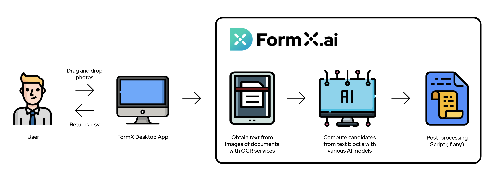

# Basics

## Not up for reading?

We have create a video covering our core concepts and which feature suits your requirements.



## What is FormX?

FormX is a data extraction service, transforming analogue information on physical documents into digital, structured JavaScript Object Notation \(JSON\) values. Once you upload a copy of a document \(in an image format\) that you'd like to extract data from, you can specify the you'd like to extract and FormX will return them in JSON format, ready to be integrated with other applications.

## So what's special about FormX?

Pulling data off physical documents is not new. Optical character readers, or software that use optical character recognition \(OCR\) technologies, already do this. Though OCR technology is already mature, it only extracts data aimlessly. While OCR can definitely obtain all information from a document, but it cannot:

* Differentiate between data pairs
* Retrieve user-defined targets
* Label targets before returning in a development-friendly format \(i.e. JSON\)

**FormX can do them all**, by implementing a series of artificial intelligence \(AI\) models. On top of some popular OCR services, FormX applies an AI layer to filter, locate, group and label data, before the result is passed back to the user in JSON format.

## How can FormX be used?

There are two main pain points that FormX can solve. Both scenarios require some quick set-up. For the time being, _Form_ creation and all set-up tasks can only be carried out on the FormX [portal](https://formextractor.oursky.com/form). Meanwhile, extractions can be done on the FormX portal, desktop app or via application programming interfaces APIs, where you can submit photo-copies of documents and receive results.

Here’s a quick summary of FormX’s platforms:

* FormX ****Portal - Its functionalities include setting up form, managing on payment and access token, downloading the desktop app and testing out sample images one by one.
* FormX ****Desktop App - Available on Windows and Mac; it's designed for batch uploads and processing form images.
* API - An inherent way to integrate FormX with your applications.

Below is a diagram visualizing FormX API calling flow. Note that a _Form_ has to be set up first before extraction can take place.

And if you instead wish to directly save excel-ready extraction results to your machine instead of obtaining them on an application, you can drag target photos to our desktop app:

Before diving into the user scenarios, it's crucial to understand what a _Form_ is in FormX.

### What is a _Form_?

A _Form_ represents a format of document. By creating and configuring a _Form_, a user passes a set of instructions about a specific form format to FormX, which will be used to extract information from forms with such format.

Guides on using the portal and setting up a _Form_ are covered in later tutorials, for now you only have to understand the concepts.

### Scenario 1: Data extraction from a set of documents with the same format

The user will first need to create a _Form_, upload a _master image_ \(i.e., the image from which data extraction will be modelled from\), then set it up by specifying extraction requirements and labelling target areas of information. FormX will then learn \(i.e. compute features\) from this _form._ Future data extractions will be executed based on these learnings. 

In short, the user _tells_ FormX about the format of incoming documents, so that FormX _understands_ what data to extract from the uploaded images, and which areas these data are.

**TL;DR:** FormX works for any set of documents, **with the same format**.

**Examples:** Insurance forms, bank statements, licenses, certificates issued by government agencies, etc.

### Scenario 2: Data extraction from all kinds of documents with Auto Extraction Items

Unlike the aforementioned scenario, FormX can still be used _without a_  _master image_. FormX offers a list of [Auto Extraction Items](features/auto-extraction-items.md), which are a bunch of targets that can be pulled off from different types of documents.

FormX already has corresponding AI models trained. As a result all a user has to do is to create a _form_ and tick the targets from the list of Auto Extraction Items. 

For example, let's say you want to get the date from a pile of receipts. Tick the date box under the list of Auto Extraction Items on FormX's portal. You can then upload the image copies of the receipts and have their date extracted.

**TL;DR:** FormX can extract specific data targets from any documents, **as long as FormX supports that target**.

**Examples:** Receipts, tickets \(e.g. flight, train, movie, etc.\), bank statements \(if only available targets are needed\), etc.

### Explaining with examples

To further help you grasp these ideas, let's go through a few examples. Let's say you have three types of documents with the following extraction targets:

1. A pile of **driving licenses** with same format — **name, address, age**
2. A pile of **business registration** documents, same format — **company name, issue date, address**
3. A stack of **receipts** from different shops — **date, time, price**

Let's say that you need to extract aforementioned data on these documents for your system and you want to automate the extraction process with FormX. In this case, you will need to create three forms on FormX's portal. 

Since 1 and 2 both have a format to follow, they lie in the first scenario. They will follow the same set-up flow:

* First, pick a member out of the pile with a clear resolution
* Create a _Form_ and upload that member as the master image
* Set up the _Form_ with tools on our portal, e.g. labelling areas, specifying target data
* Save!

For 3, these types of documents are issued by a range of shops so they don't share a format. Therefore, the set-up flow will be a bit different:

* Create a _Form_ with no master image
* Specify Auto Extraction Items
* Save!

Easy peasy! Now the three forms are ready for their own document data extraction.

## Tutorial time!

Each scenario has its own tutorial. After finishing them, you'll be more familiar with FormX's use cases!

**Scenario 1 Tutorial:** [Set up a form with master image](get-started/set-up-a-form-with-master-image.md)

**Scenario 2 Tutorial:** [Set up a form without master image](get-started/set-up-a-form-without-master-image.md)

## Got a problem waiting to be solved?

We have aggregate the needs and solutions into a [table](get-started/feature-pointing-guide.md), which you can tackle your challenges accordingly! 

## Further readings

Once you have finished the tutorials and would like to learn more about the implementation of FormX, this [article](https://code.oursky.com/how-to-implement-receipt-data-extraction-ocr-regex-ai/) is for you!

