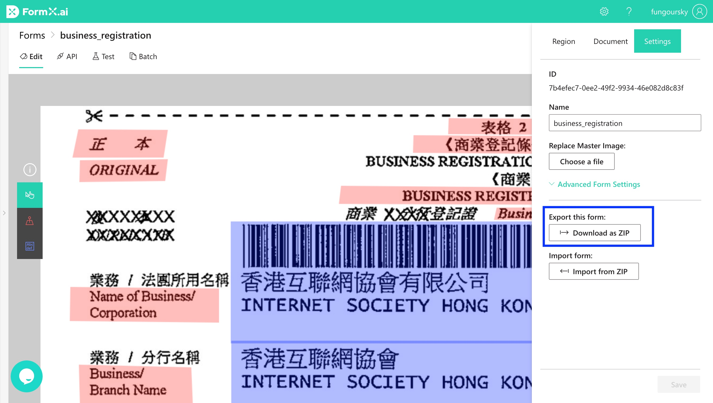
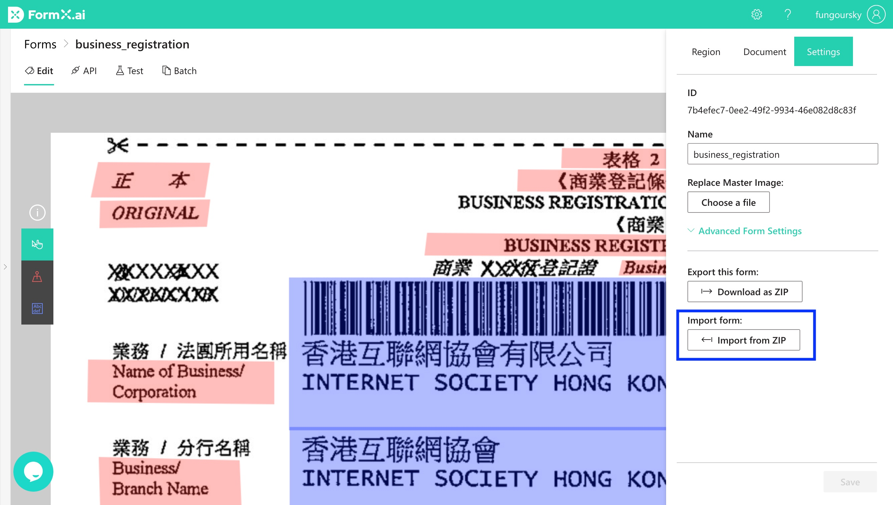

# Import and Export Forms

## Export a Form

1. Select the Form in the **Form List** to open the Editor
2. Go to the "**Settings**" tab in the right panel
3. Click "**Download as ZIP**" to download the form

## Export a Form Group

1. Select the Form Group in the **Form Group List**
2. In the "Edit" tab, click "**Download as ZIP**" at the top-right corner to download the Form Group

## Import a Form

### Import as a new Form

1. Go to the **Form List** Page
2. Click the "**Import Form**" button in the top bar
3. Select the ZIP file from your system
4. Done! Your form is imported!

### Import and replace an existing form

You can import a form to replace an existing form. The form will keep the same Form ID. This is useful when performing an update.

1. Go to an existing form
2. Go to the "**Settings**" tab in the right panel
3. Click "**Import from ZIP**" and upload a ZIP file
4. Done! Your form is replaced by the imported one!

## Import a Form Group

1. Go to the **Form Group List** Page
2. Click the "**Import Group**" button in the top bar
3. Select the ZIP file from your system
4. Done! Your form group is imported!

