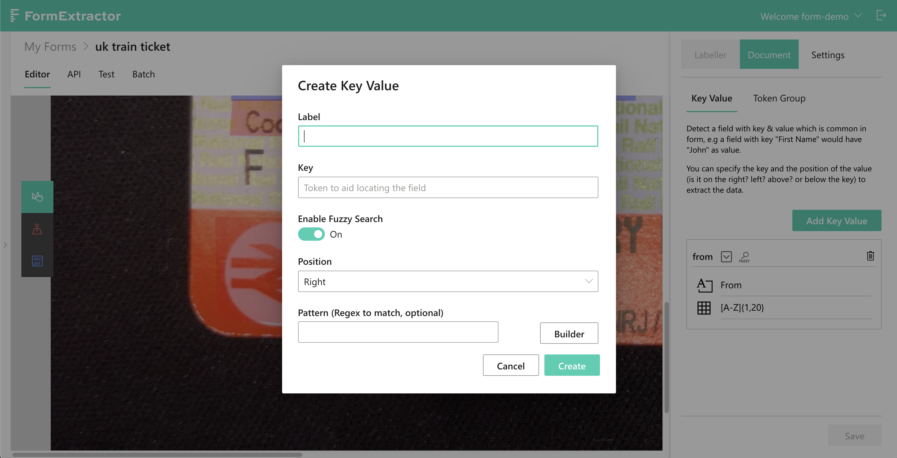
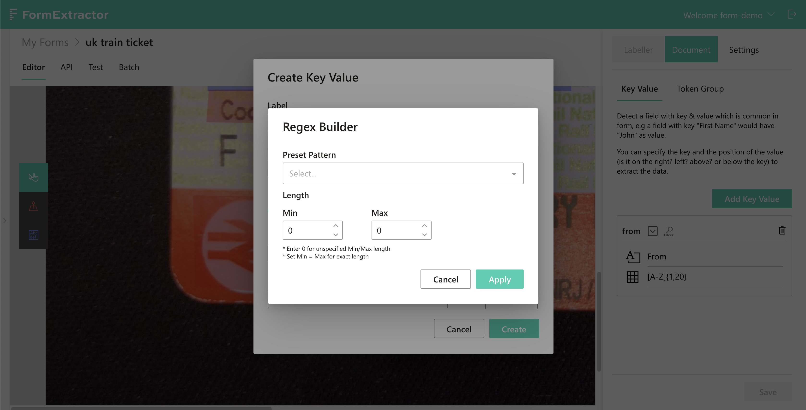

# Key Value Pattern Detection

## A quick guide

Sometimes, a user would like to extract some target \(i.e. a "Value"\) based on its surrounding text, which, in this feature one is called a "Key". FormX provides Key Value pattern matching to hep users achieve this. Say you are looking for some ID on a receipt which is always printed on the right side ofthe word "ID:", you can add a Key Value pair with "ID:" as the label and leave the position field unchanged as its default is "right". To boost accuracy, you can also enable fuzzy search and/or apply regular expression.

## How to add a Key Value pattern

To set a Key Value pattern, navigate to the "Key Value" tab under "Document" on the right bar and click the "Add Key Value" button. The following builder will pop up, as shown below:

"Label" is for user reference purposes only, so make sure to enter something that describes this Key Value pair well. "Key" is the "anchor" to locate the "Value". For example, if you have a train ticket and you'd like to get the value under "Destination", enter "Destination" as the key and change position to "Bottom". 

To increase the accuracy, you can choose to provide a regular expression, which FormX provides a builder to aid you in creating one.

From our preset patterns choose one that suits your value. You also have the option to specify the length. Click "Apply" once all are set.

