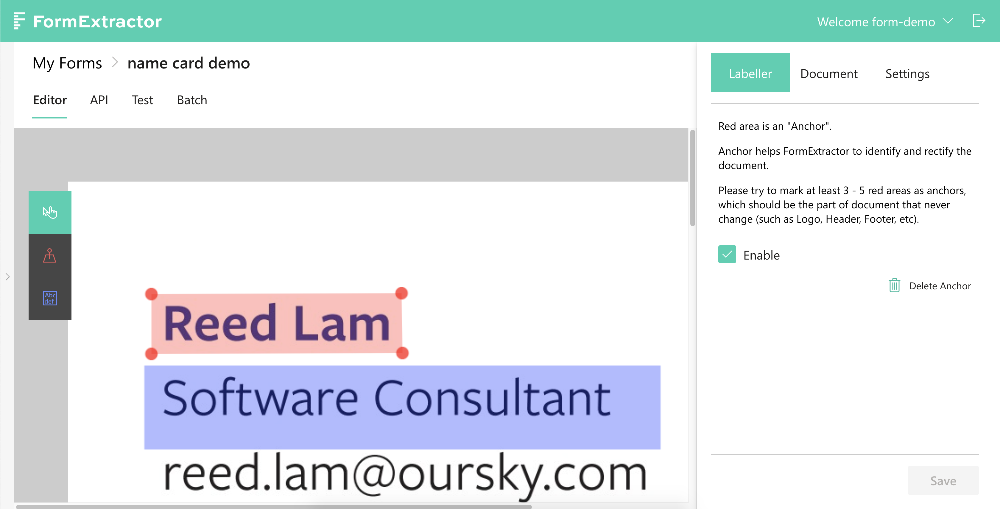

# Anchor

As its self explanatory name suggests, an _Anchor_ is a position keeper. They play an essential part in warping future uploaded images to match the master form, before extraction can properly take place.

As a result, anchoring properly is extremely important to yield favourable extraction results. Identical parts among your documents u make good _Anchors_. It's also recommended to have at least 2 _Anchors_, preferably stretched as much as possible on the master image.

Say you have only 2 _Anchors_, to boost accuracy their location should be top and bottom, top left and bottom right, top right and bottom left, or left and right. The idea is to cover as much area as possible with the longest distance possible between the _Anchor_ pairs.

Above is an example of _Anchor,_ where in the right bar has an tick box allowing user to decide whether one is enabled or not.

