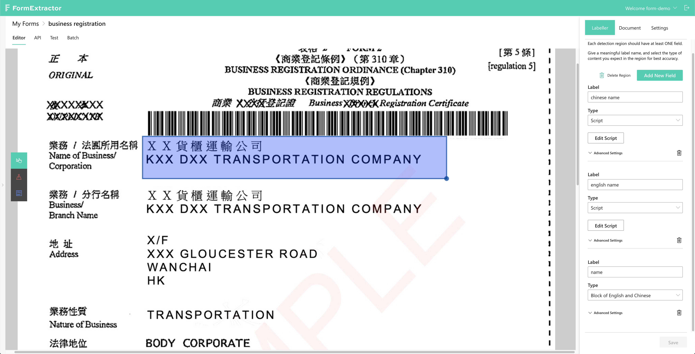

# Detection Region

A user can specify an area with _Detection Region_ when some data is needed from that part of _Form._ If you'd like to extract several data items from an area, a _Detection Region_ accepts multiple extraction fields.

The above screenshot shows a _Detection Region_ with three extraction fields, "chinese name", "english name" and "name" that contains the previous two. To filter out the not needed parts in the previous two fields \(i.e. no Chinese in English name, and vice versa\), they are both set to type "Script" where some JavaScript is written to do the job. Meanwhile since the "name" field takes both the English and Chinese name, it can simply be set to "Block of English and Chinese".

Currently there are 10+ available types for an extraction field. Besides, you can tweak with some advanced settings as well where you specify OCR providers and APIs to use.

