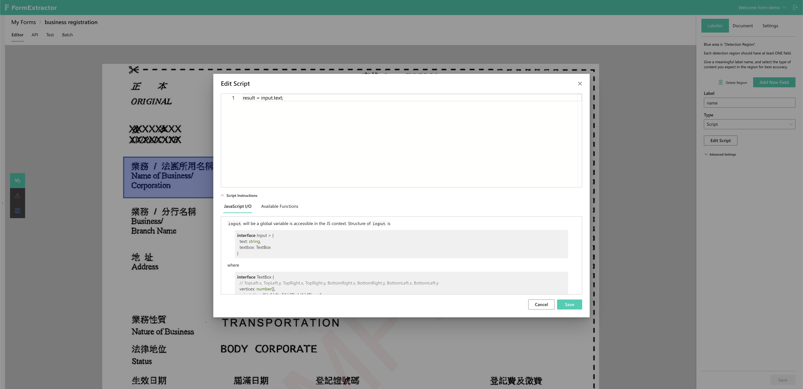

# Post-Processing Scripts

## A quick guide

A user may want to process the output from [Detection Regions](labeller/detection-region.md), as OCR services can return some false, inaccuratem or unintended results, such as some incorrectly recognized characters or extra whitespaces. With post-processing scripts, they can apply filters to strip unwanted characters and add mappings to correct undesirable results. Another possible case is that the user may wish to reformat or restructure the returned results. Adding a custom JS script enables the returned data to be tailored to whatever the user wants.

## How to add your own script

In a Form's editor, create a Detection Region. The active tab in the right bar will automatically be switched to "Labeller". Then change "Type" to "Script" as shown below:

Click "Edit Script" to open up the script editor where you can input your own script in JavaScript:

In fact, we've used this feature ourselves quite frequently. Almost all [templates](templates.md) have a few Detection Regions' marked as "Script" where various text-processing functions are applied.

