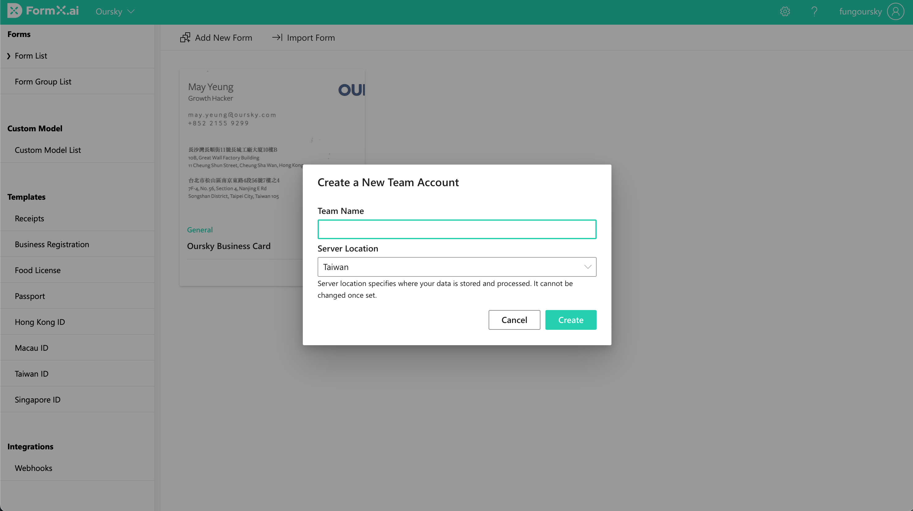
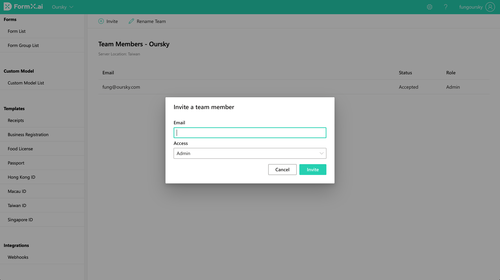
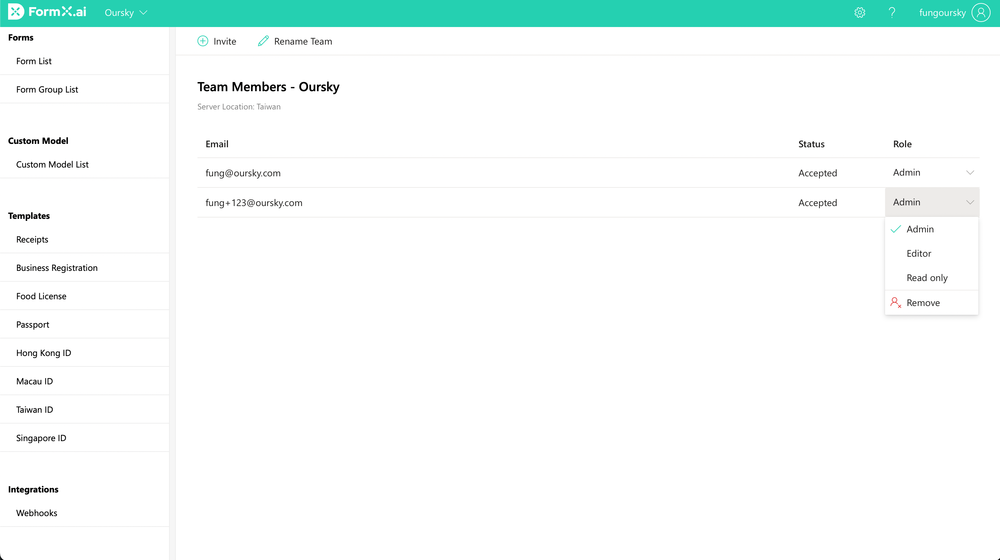

# Teams and Server Location

## Create a Team&#x20;

1. In the team selection dropdown, select "**New Team**"
2. Enter the team's name and server location

Server location specifies where your data is stored and processed. It cannot be changed once set. The current available locations are Taiwan and Singapore.

## Invite a team member

1. Select "**Manage Team**" **** in the settings dropdown located at the top bar
2. Click "**Invite"**
3. Enter the invitee's email and their team role

The invitee will receive an email with a link to accept the invitation. The invitation is valid for 72 hours. To change or send a new invitation, delete the current invitation and send a new one.

You can also assign a new team role to a member after they accepted the invitation.

### Team roles and their permissions

Here is a list of the available team roles and their permissions.

| Permission                   | Admin | Editor | Read Only |
| ---------------------------- | ----- | ------ | --------- |
| View Subscription and Usage  | Y     | Y      | Y         |
| View Team members            | Y     | Y      | Y         |
| View Form config             | Y     | Y      | Y         |
| Copy FormID and Access Token | Y     | Y      | Y         |
| Edit Form config             | Y     | Y      | -         |
| Add/Remove Form              | Y     | Y      | -         |
| Change Subscription          | Y     | -      | -         |
| Add/Remove Team member       | Y     | -      | -         |
