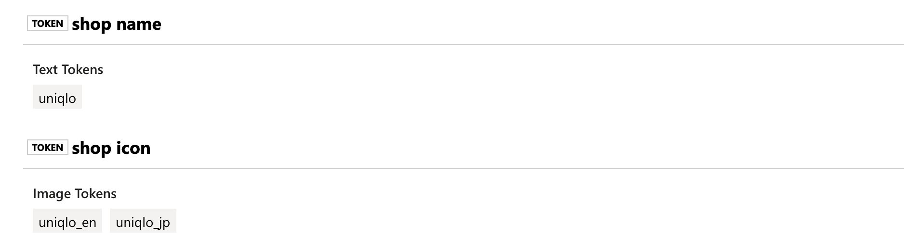

# Token Group

## A quick guide

A token group was originally designed and developed to differentiate receipts by user-specified inputs.

Let's say you have N possible shops issuing receipts and you'd like to distinguish which receipt belongs to which shop. To do that you can navigate to a Form, then switch to the "Token Group" tab and do the following:

1. Create a token group called "Shop Names" then input the N shop names.
2. Create another token group called "Shop Icons" and upload the N shop icons.
3. Click save!

Finally, throw in some receipts and have the tokens matched.

### Text Token

Once a text token is added to a [_Form_](../background.md#what-is-a-form), FormX will always look for a match on uploaded documents. User can opt for an exact match or have all whitespace trimmed when matching is performed.

### Image Token

The image version of text token, where a user can upload an image and FormX will search through uploaded documents to find a match.

## Some examples

It can be challenging to gather a bunch of receipts in a short time, so we have an example here to show you how.

Here's a set of Uniqlo [receipts](https://drive.google.com/drive/folders/1Aoo5IP-26rhZztlx3w710GtP2ctXIA42?usp=sharing). Click "Download" where one will be triggered with the content compressed in a `.zip` file. Uncompress the downloaded file and you will get a directory that looks like the following:

```text
.
├── icons
│   ├── uniqlo_en.png
│   └── uniqlo_jp.png
├── receipt_uniqlo_1.jpg
├── receipt_uniqlo_2.jpg
├── receipt_uniqlo_3.jpg
└── receipt_uniqlo_4.jpg
```

Add one text token and two image tokens, then do the following:

1. Create a token group called "Shop Names" and add a text token named `uniqlo` which is on all samples you have just downloaded.
2. Create another token group called "Shop Icons". Inside the unzipped folder you've downloaded there is an icon subfolder. Upload the two images inside - `uniqlo_en.png` and `uniqlo_jp.png` under the newly created image token group, then named them from their file name.
3. Save!

Now, navigate to the "Test" tab and pull in the downloaded samples in one by one. You will see that all three tokens we've added just now are showing up in the results, as shown in this screenshot:



The JSON output indicates the tokens are matched as well, where the tokens are **grouped** and **labeled**:

```text
{
  "status": "ok",
  "form_id": "some_id",
  "fields": [],
  "auto_extraction_items": [
    {
      "name": "total_amount",
      "value": 308
    },
    {
      "name": "date",
      "value": "09/09/2019"
    },
    {
      "name": "time",
      "value": "15:15:00"
    }
  ],
  "token_groups": [
    {
      "id": "some_id",
      "name": "shop name",
      "texts": [
        {
          "id": "some_id",
          "value": "uniqlo"
        }
      ]
    },
    {
      "id": "some_id",
      "images": [
        {
          "id": "some_id",
          "value": "uniqlo_en"
        },
        {
          "id": "some_id",
          "value": "uniqlo_jp"
        }
      ],
      "name": "shop icon"
    }
  ]
}
```

