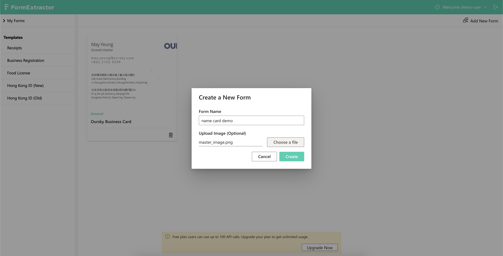
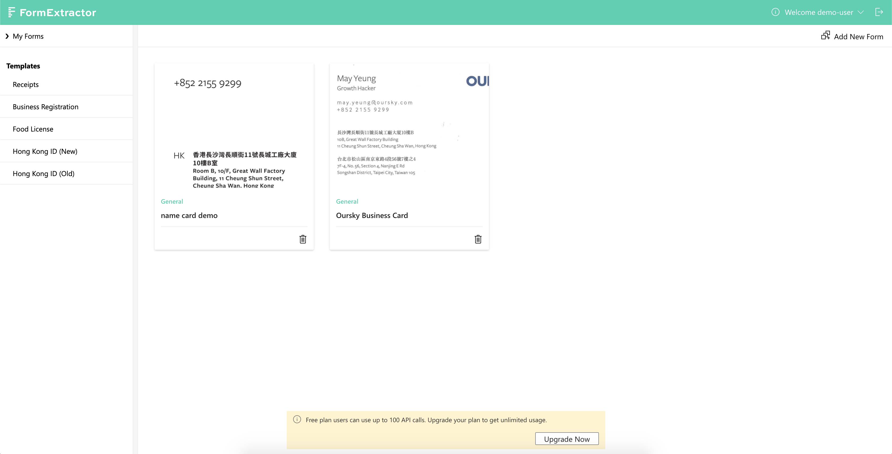
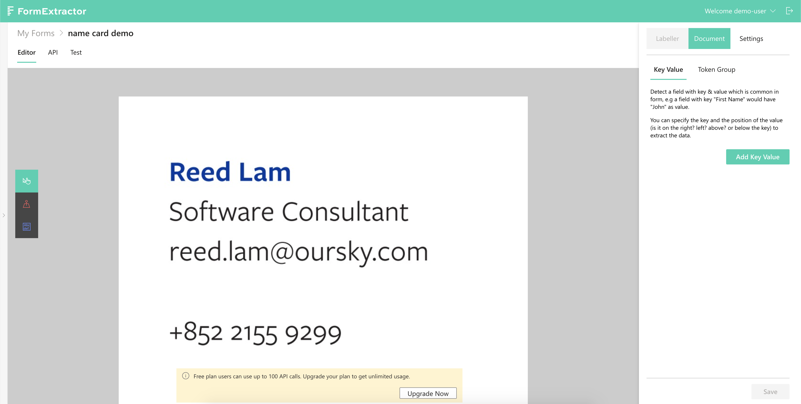
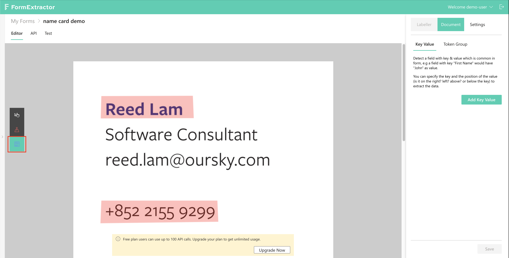
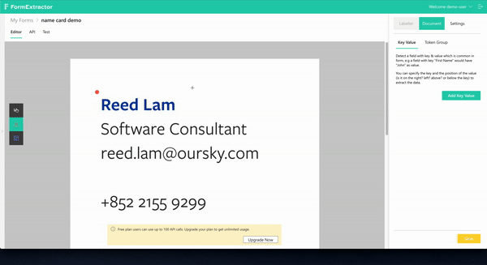
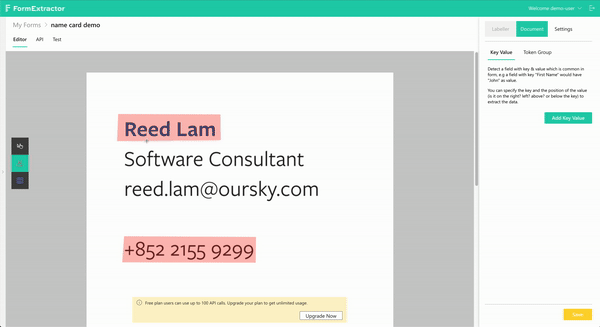
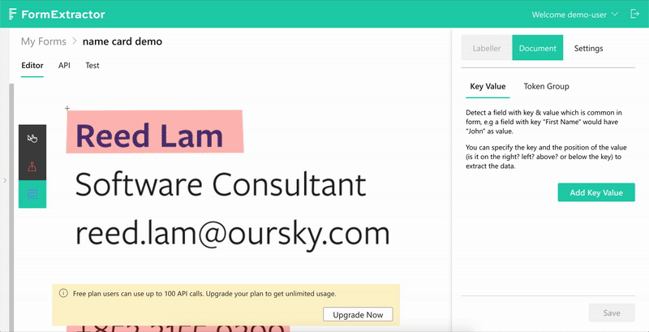
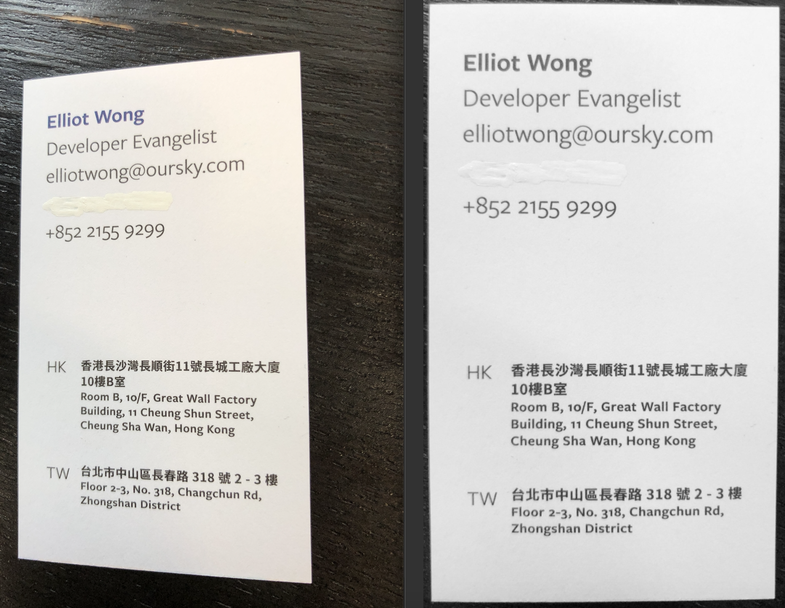

# Set up a form with master image

## Prerequisites

* An account on FormX [portal](https://formextractor.oursky.com/)
* Have basic understanding on [background](../background.md) of FormX
* Download [sample name cards](https://drive.google.com/drive/folders/1DUEMq6uoKQmFWw-gI9gMXrGyW3VLKIAt?usp=sharing) that will be used in this tutorial

## Aims

Obtain {name, job title, email} from given name cards.

## Create a Form

Navigate to the form listing page of FormX and click the "Add New Form" button on top right corner.

You will be promoted with a Create Form modal. Name this form "name card demo" and upload the `master_image.jpg` from the downloaded sample name cards. Then click "Create".

A new form will be created. Click on the "name card demo" new form.

You will be redirected to the form editor page.Now we can start setting up so that FormX can extract the sample name cards based on this form.

## Labelling the form

First we will start with marking areas on the master form.

### Anchors

#### Definition

An _Anchor_ is a labelled area that serves as a positional reference point, allowing FormX to warp uploaded images of this form accordingly. Since uploaded images are more or less different \(e.g. a tilted angle\) from the master image, FormX will twist them by matching their _Anchors_ to the master form's ones before extracting.

**TL;DR:** Like an actual anchor, drop one on your master form to prevent future uploaded forms from moving away. 

You may be wondering - which parts in the master form should I include with an _Anchor_? Identify the common parts of your documents \(with the same format, of course\), then include them with an _Anchor_ then you are pretty much done.

#### Adding some to the name card master image

We will mark four anchors - name, telephone number, HK and TW address. Name and TW address are especially important, as they are respectively the topmost and bottom most element in our name cards. Anchoring them does facilitate the warping process significantly.

Choose second tool as shown in the below image to mark an _Anchor_.

Then mark four points as shown in the below GIF. Note that to create an _Anchor_, the final point must connect with the first.

Once the name and telephone number are marked, scroll down and include the two addresses as well.

The master form now has enough _Anchors_, which future uploaded name cards will have their corresponding parts checked against.

### Detection Regions

#### Definition

Its name should be self explanatory enough, these areas are marked when you need something extracted from them. One _Detection Region_ can have several extraction field, as one region can contain several items that are worth obtaining.

**TL;DR:** Mark the area where you want information extracted from on the master form with _Detection Region._

#### Adding Detection Regions

We will extract name, job title and email for these name cards. To do so, they will be marked with _Detection Regions_.

Choose the third tool as shown in the below screenshot:

I have magnified the screen in the following GIF to show the fields clearly. In this step we will add three _Detection Regions_, each contains a field called - name, job title and email respectively.

Be sure the click the "Save" button. We have now finished setting up this form!

## Test out with other name cards

There are two more name cards in the zip file you have downloaded right at the start of this tutorial. In this section they will be fed to our freshly created form to have the targets extracted.

Navigate to the "Test" tab and choose `sample1.JPG`. This will trigger an extraction which will complete in no time. Repeat these steps with `sample2.JPG` and you will get very similar results.

In both our tries, we can see the input images are warped and "aligned" to the master form. The extraction results are listed out with each's corresponding fragment of image, and all enclosed in a JSON at the very bottom.

Both images were casually taken with a mobile phone. You may have already noticed that the first one has a more titled angle while the other has higher background noise. Images submitted to FormX will go through several image enhancing processes before they are submitted to OCR services and later fed to AI models, therefore phone taken images are perfectly fine. And with references provided from the _Anchors,_ images are warped before our AI models start pulling information.

## Integrate with any app

Via calling our APIs, extraction results can be obtained at any app. Navigate to the "API" tab, then copy both the form ID and your access token by clicking the buttons on the top right corner. 

We will then try calling the API with curl. Copy our curl example, replace the corresponding placeholders then press enter! With the correct payload given you will soon get the results. Simply translate this curl command to whatever language you app is built with, and you have got FormX integrated.

If you'd like to learn more about the APIs, we do have a complete doc down the "API" tab.

## Done!

Props to you, you have now successfully extract information from a set of documents that share the same format! One more [tutorial](set-up-a-form-without-master-image.md) to go!

