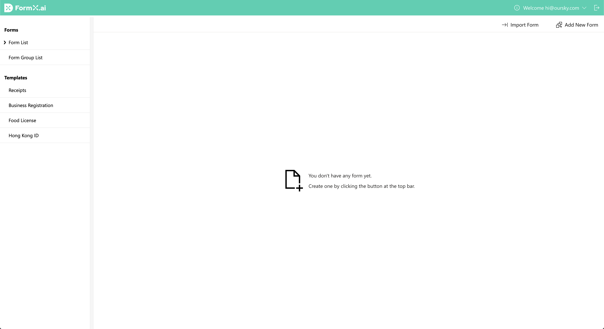
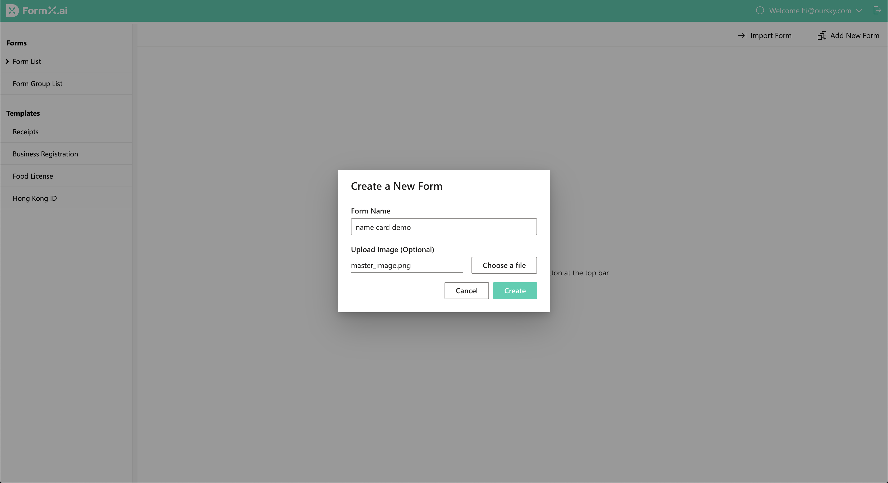
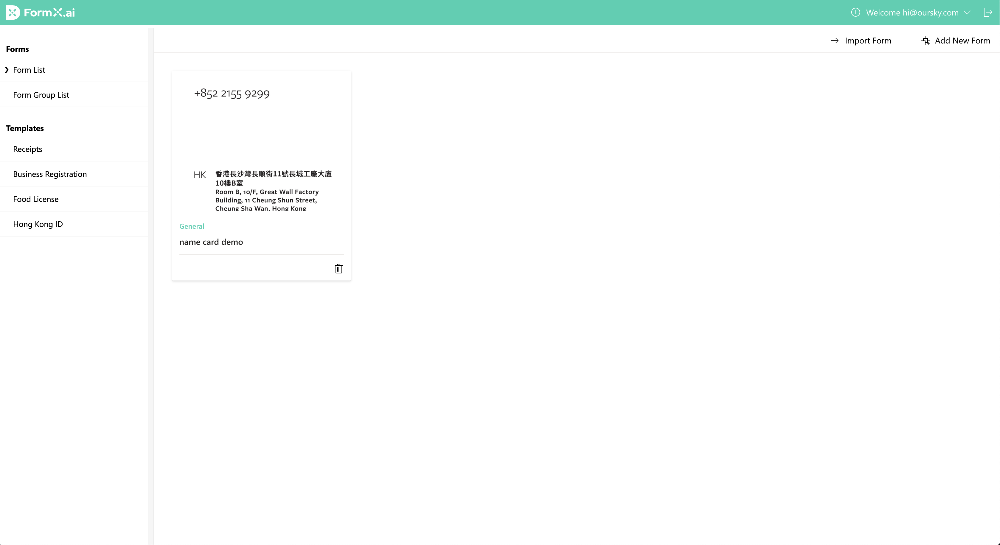
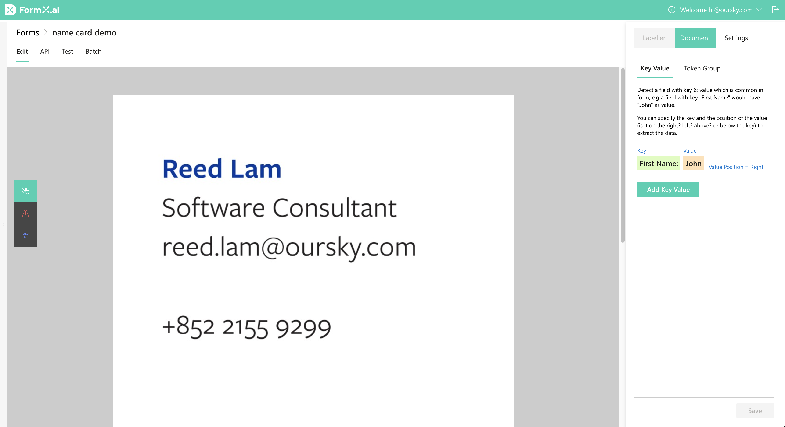
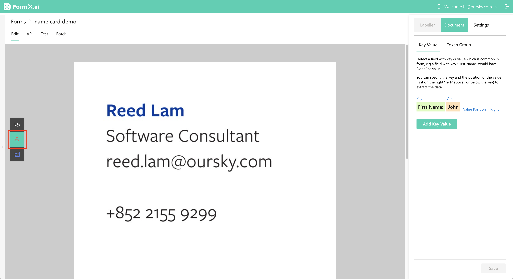
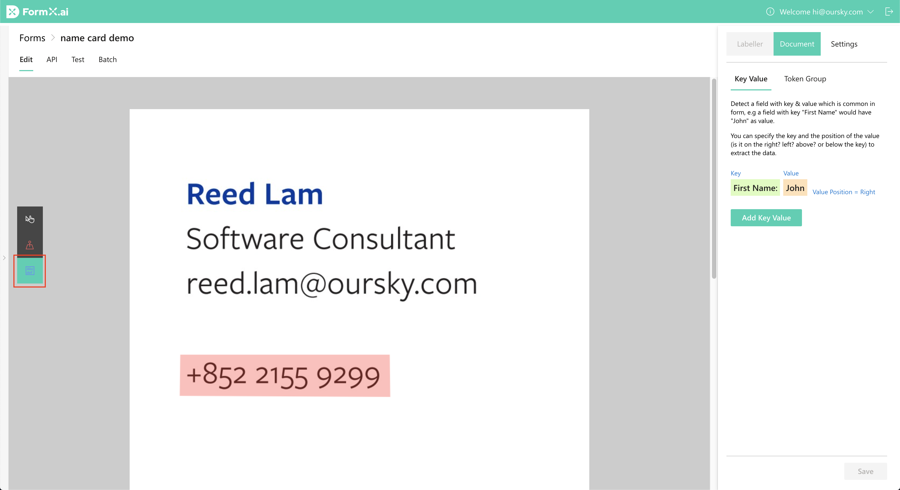
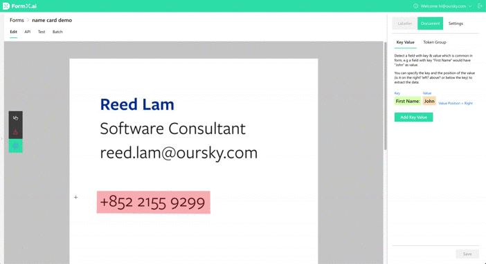

# Set up a form with a master image

## Prerequisites

* An account on FormX [portal](https://formextractor.oursky.com/)
* An understanding on [background](../background.md) of FormX's basics
* [Sample business/name cards](https://drive.google.com/drive/folders/1DUEMq6uoKQmFWw-gI9gMXrGyW3VLKIAt?usp=sharing) that will be used in this tutorial

## Objective

Obtain the following information from the business/name cards: {name}, {job title}, {email}.

## Creating a Form

Navigate to the form listing page of FormX and click the "Add New Form" button on the top right corner.

You will be prompted with a Create Form modal. Name this form "name card dem" and upload the `master_image.jpg` from the downloaded sample name cards. Then click "Create".

A new form will be created. Click on the "name card demo" new form.

You will be redirected to the form editor page.Now, you can start setting it up so that FormX can extract data on the sample name cards based on this form.

## Labelling the form

Now, with the newly created form, we'll go through a few concepts before marking areas on the master image.

### Anchors

An [_Anchor_](../features/labeller/anchor.md) is a labeled area that serves as a **positional reference point**, allowing FormX to warp uploaded images of a form. Since uploaded images are more or less different \(e.g. a tilted angle\) from the master image, FormX will have to twist them by matching their _Anchors_ to the master form's ones before extracting.

For every form with a master image, **a user has to mark at least two** _**Anchors**_, with the longest distance possible between them. When they are further part, more of the form resides between them, which will improve extraction accuracy since the warping process becomes more consistent. 

**TL;DR:** Like an actual anchor, drop one on your master form to prevent future uploaded forms from moving away. **At least two are required for FormX to function properly.**

You may be wondering: which parts in the master form should I mark with an _Anchor_? Identify the **common parts** of your form, then include them with an _Anchor_. Bear in mind that parts which vary across different documents of the same form should **not** be anchors.

#### Adding some to the name card master image

In the example, we'll mark three anchors — telephone number, Hong Kong \(HK\) and Taiwan \(TW\) address, which are the **common parts** of this Oursky name card form. Other areas like name, position and email are different on every name card instance, so they **don't make good** anchors.

Choose the second tool as shown in the image below to mark an _Anchor_.

Then mark four points as shown in the GIF below. Note that to create an _Anchor_, the final point must connect with the first. Once the name and telephone number are marked, scroll down and include the two addresses as well

The master form now has enough _Anchors_, which can then be used to check the corresponding parts of future uploaded name cards.

### Detection Regions

_Detection Regions_ are the areas that are marked from which you need data extracted. One _Detection Region_ can have several extraction fields, as one region can contain several items of data that are worth obtaining or extracting.

**TL;DR:** Mark the area where you want information extracted from on the master form with _Detection Region._

#### Adding Detection Regions

In this example, we'll extract name, job title and email for these name cards. To do so, they will be marked via _Detection Regions_.

Choose the third tool marked with a red box in the screenshot below:

As shown below, we'll add three _Detection Regions,_ each containing a field called ‘name,’ ‘job title,’ and ‘email’.

Click the "Save" button. Now you've finished setting up this form!

## Test it out with other name cards

There are two more name cards in the ZIP file you've downloaded at the start of this tutorial. They will be fed to our freshly created form to have the target data extracted.

Navigate to the "Test" tab and choose `sample1.JPG`. This will trigger an extraction which will complete in no time. Repeat these steps with `sample2.JPG` and you will get similar results.

Try both name cards and you will see that the input images are warped and "aligned" to the master form. The extraction results are listed out with each image's corresponding fragment, and enclosed with a JSON value at the very bottom.

As a result, images taken my mobile devices \(i.e., smartphones\) work well with FormX, which you may have already noticed. 

The first name card has a more titled angle while the other has higher background noise. Images submitted to FormX will go through several image enhancing processes before they are submitted to OCR services and later fed to AI models. One of these processes is image warping, made possible with _Anchors_ marked.

## Integrating FormX with any app

By calling our APIs, extraction results can be obtained using any app. Navigate to the "API" tab, then copy both the form ID and your access token by clicking the buttons on the top right corner. 

Try calling the API with curl. Copy our curl example, replace the corresponding placeholders then press enter! With the correct payload given, you will promptly get the results. Simply translate this curl command to whatever language your app is built with, and you'll have got FormX easily integrated.

If you'd like to learn more about the APIs, we have a complete documentation in the "API" tab.

## Done!

You've now successfully extracted information from a set of documents that share the same format! One more [tutorial](set-up-a-form-without-master-image.md) to go!

