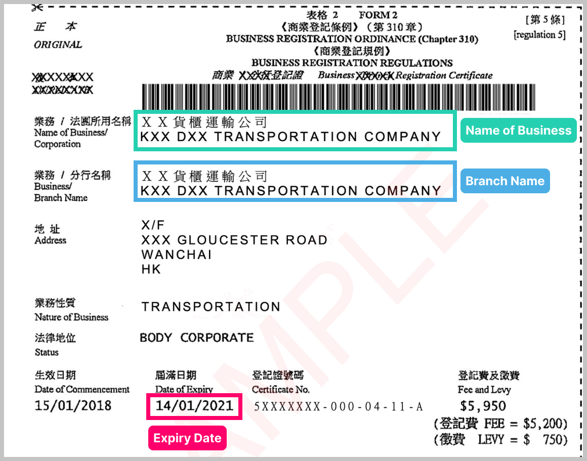
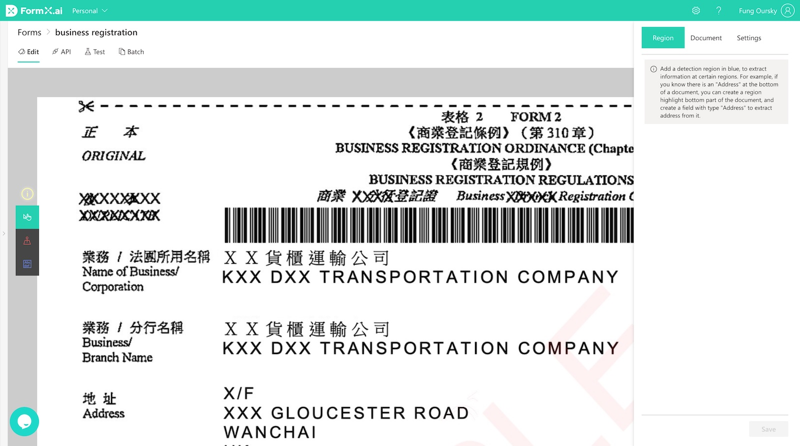
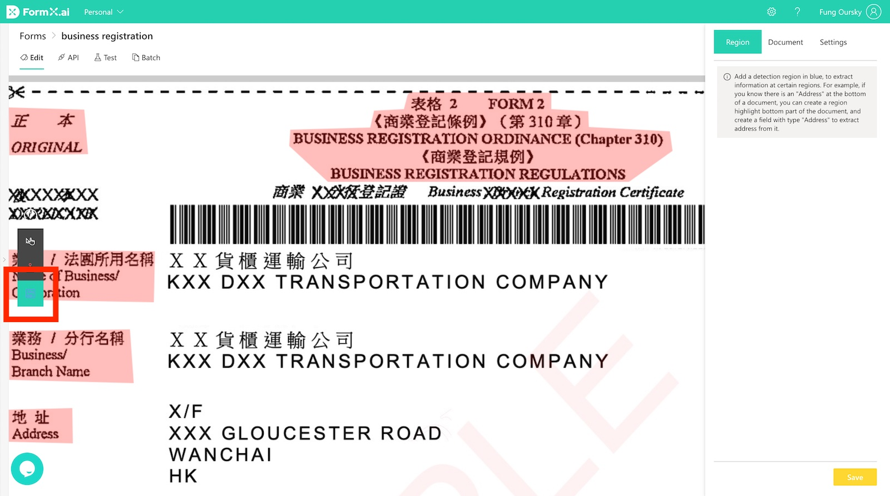

# Set up a form with a master image

## Video Demo

Here is a video demo of how to create a fixed format extractor on the FormX Portal. See 3:31-6:35 of the video.


03:31 Fixed Format Document Parsers


## Prerequisites

* An account on FormX [portal](https://formextractor.oursky.com)
* A high quality scan of a specimen of the document you wish to extract. In the tutorial, a sample [Business Registration (BR) Forms](https://drive.google.com/drive/folders/12hSnSbN2JyY\_iwi3XAhBiMxpp1wCvHib?usp=sharing) will be used

## Objective

Obtain the following information from the business registration forms:&#x20;

* Name of Business
* Branch Name
* Expiry Date

## Step 1: Creating a Form

Navigate to the **Form List** page of FormX portal and click the "**Add New Form**" button at the top left corner and choose **My Documents have a fixed format.**

Name this form "_business registration form_" and upload the [`br_master_image.jpg`](https://drive.google.com/file/d/1YF3RddeqKW4J11vO9QhuiCOfWca9--Rh/view?usp=sharing) from the downloaded sample BR forms as **Master Image**. Then click "**Create**".

A new form will be created. Click on the "business registration form" new form.

You will be directed to the **Form Editor** page. Now, you can start setting it up, so that FormX can extract data from the other BR forms based on this form.

## Step 2: Set up the form

Now, we'll first go through a few concepts before marking areas on the master image.

### Anchors

An [_Anchor_](../features/labeller/anchor.md) is a labeled area that serves as a **positional reference point**, allowing FormX to warp uploaded images of a form. Since uploaded images are more or less different (e.g. a tilted angle) from the master image, FormX will have to twist them by matching their _Anchors_ to the master form's ones before extracting.

For every form with a master image, **a user has to mark at least three **_**Anchors**_, with the longest distance possible between them. When they are further part, more of the form resides between them, which will improve extraction accuracy since the warping process becomes more consistent.&#x20;

**TL;DR:** Like an actual anchor, drop one on your master form to prevent future uploaded forms from moving away. **At least three are required for FormX to function properly.**

An example image is shown below, where two parts on a Business Registration form are marked as _Anchors_ - the "ORIGINAL" one and the title. We will go through anchor-marking in a later paragraph.

You may be wondering: which parts in the master form should I mark with an _Anchor_? Identify the **common parts** of your form, then include them with an _Anchor_. Bear in mind that parts which vary across different documents of the same form should **not** be anchors.

#### Adding some to the master image

In the example, we'll mark three anchors which are the **common parts** of a BR form. Other areas like the actual name of business (i.e. KXX DXX TRANSPORTATION COMPANY) are different on every BR instance, so they **don't make good** anchors.

Choose the second tool as shown in the image below to mark an _Anchor_.

Then mark points where the last connects with the first to create an _Anchor_, as shown in the GIF below.&#x20;

The master form now has enough _Anchors_ to warp properly.

### Detection Regions

_Detection Regions_ are the areas that are marked from which you need data extracted. One _Detection Region_ can have several extraction fields, as one region can contain several items of data that are worth obtaining or extracting.

**TL;DR:** Mark the area where you want information extracted from on the master form with _Detection Region._

#### Adding Detection Regions

In this example, we'll extract name of business, branch name and expiry date from BR forms. To do so, they will be marked with _Detection Regions_.

Choose the Detection Region tool marked with a red box in the screenshot below:

Drag across the desired data region on the image and add a **Detection Field**. Give the field a label for identification.

FormX can automatically extract Text, Barcode/QR codes, date, addresses, or more formats from the region. Choose the right field type and field settings to get an optimized result.

As shown below, we'll add three _Detection Regions,_ each containing a field called "name of business", "branch name", and "expiry date".

Click the "Save" button. Now you've finished setting up this form!

## Test it out with other BR forms

There are two more BR forms in the ZIP file you've downloaded at the start of this tutorial. They will be fed to our freshly created form to have the target data extracted.

Navigate to the "Test" tab and choose `br_2_mobile_taken`. This will trigger an extraction which will complete in no time. Repeat these steps with the other image and you will get similar results.

As shown in the gif above, `br_2_mobile_taken` originally has a tilted angle but it's corrected and aligned once it's uploaded and warped. It was taken with a mobile phone with a not-so-perfect angle, still FormX manages to enhance such images "lesser" in quality and returns satisfactory results.&#x20;

## Integrating FormX with any app

By calling our APIs, extraction results can be obtained using any app. Navigate to the "API" tab, then copy both the form ID and your access token by clicking the buttons on the top right corner.&#x20;

Try calling the API with curl. Copy our curl example, replace the corresponding placeholders then press enter! With the correct payload given, you will promptly get the results. Simply translate this curl command to whatever language your app is built with, and you'll have got FormX easily integrated.

If you'd like to learn more about the APIs, see the [API reference](../api-references/api-references-document-extraction.md).&#x20;

## Done!

You've now successfully extracted information from a set of documents that share the same format! One more [tutorial](set-up-a-form-without-master-image.md) to go!
