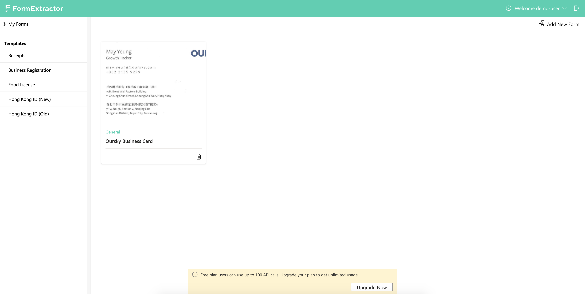
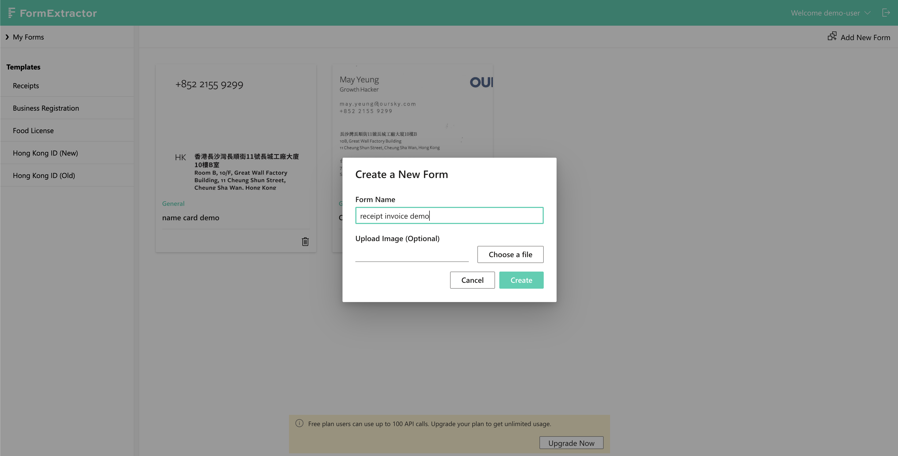
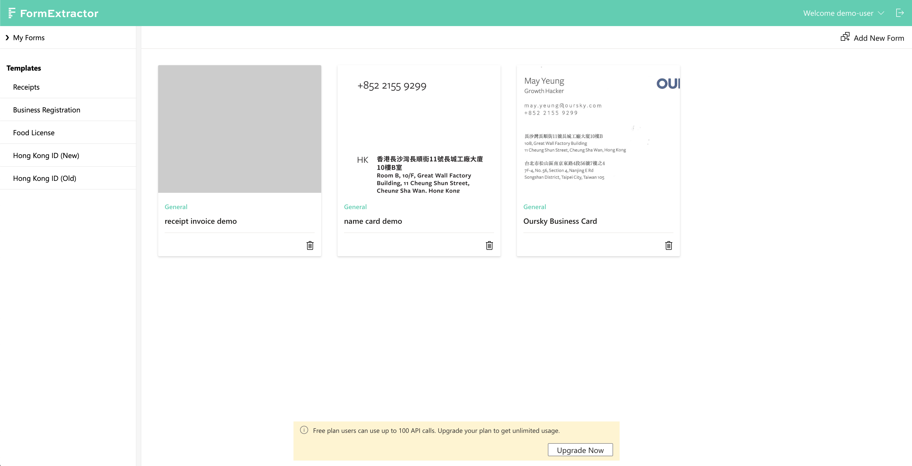
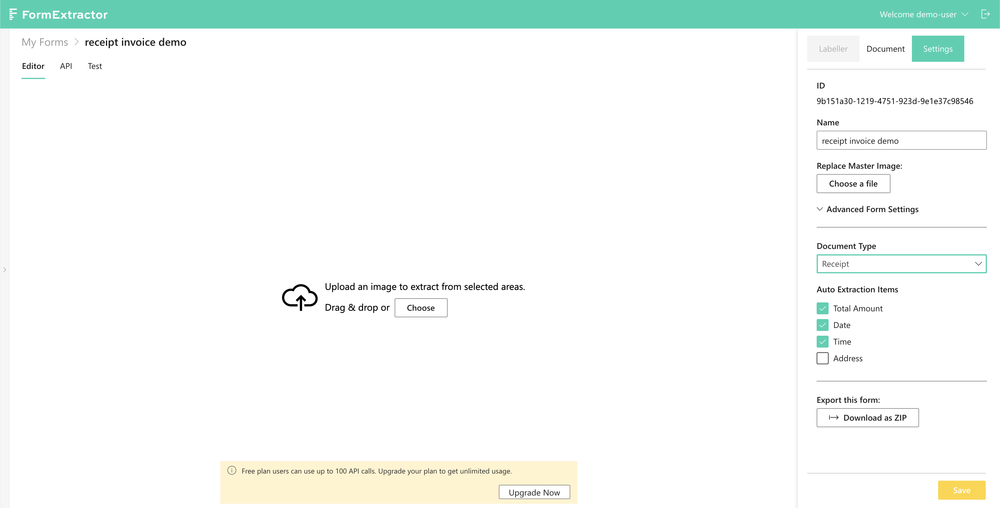
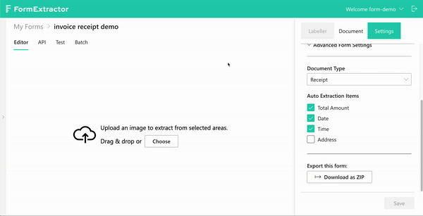

# Set up a form without a master image

## Prerequisites

* An account on FormX [portal](https://formextractor.oursky.com/)
* An understanding  of FormX's [basics](../background.md)
* Downloaded [samples](https://drive.google.com/drive/folders/15ozbfqMwXjjDd9J-YfFZH2DbVB2euQz3?usp=sharing) that will be used in this tutorial

## Objective

Obtain these data from receipts and invoices in Chinese and English: {date}, {time}, and {total amonut}.

## Create a Form

Navigate to the form listing page of FormX and click the "Add New Form" button on the top right corner.

You will be prompted with a Create Form modal. Name this form "receipt invoice demo" and upload the `master_image.jpg` from the downloaded sample name cards. Then click "Create".

A new form with no master image will be created. 

## Set up the form

A bit of background knowledge first before proceeding.

### Document Type

Some predefined document types are provided for user to choose from. Once selected, corresponding Auto Extraction Items will be automatically ticked, with some optional ones left unchanged like "Address" when the "Receipt" type is chosen.

### Auto Extraction Items

Auto Extraction Items are independent from the master image, and are scanned throughout the entire image when one is uploaded. In this tutorial although the samples \(receipts and invoices\) don't have a shared format \(and hence no master image\), our targets can still be extracted.

Go in the form and navigate to the "Settings" tab on the right bar， then change the "Document Type" to "Receipt". Once "Receipt" is picked, three Auto Extraction Items will be automatically ticked. Be sure to save before you proceed.

## Test it out

There are five samples in the ZIP file you have downloaded at the start of this tutorial with different appearances:

* `receipt_eng_food.jpg` — Receipt with numerous creases and blurry texts
* `receipt_eng_clothing.jpg` — Receipt with lots of background noises \(i.e. those english alphabets from the keyboard\)
* `receipt_chinese_equipment.jpg` — An image that includes hand holding the receipt with words in the background
* `receipt_chinese_food.jpg` — A clear receipt but slightly twisted
* `invoice_eng_clothing` — Receipt with shadows from the phone that captured it along with a stamp

From their descriptions, each of these images poses challenges in terms of extracting the targeted data. However, FormX is capable of locating and accurately pulling the data off them thanks to our well-designed training stage.

To validate this, switch to the "Test" tab and throw each of them samples in. You will see the targets — {total amount}, {date} and {time} are all properly extracted. Below is a demonstration:

## Integrate FormX with any application

Extractions can be triggered through APIs, that it FormX can be integrated with any application as long as it has an API calling ability. To do this, navigate to the "API" tab, then copy both the form ID and your access token by clicking the buttons on the top right corner. 

Call the API with curl. Copy our curl example, replace the corresponding placeholders then press enter! With the correct payload given, you'll soon get the results. Simply translate this curl command to whatever language your app is built with.

If you'd like to learn more about the APIs, we have a complete documentation on the "API" tab.

## Done!

Assuming you've completed the master image [tutorial](set-up-a-form-with-master-image.md), you're now well-equipped and can start exploring FormX's wide range of powerful features! 

